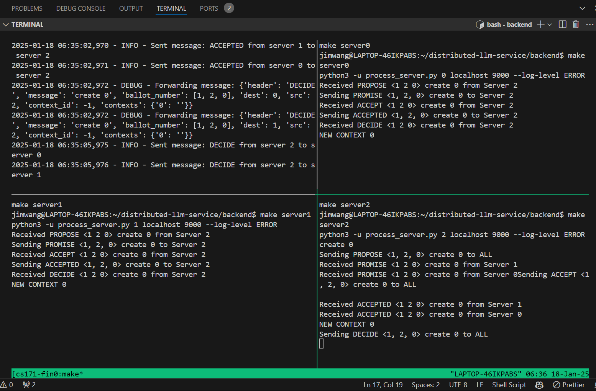
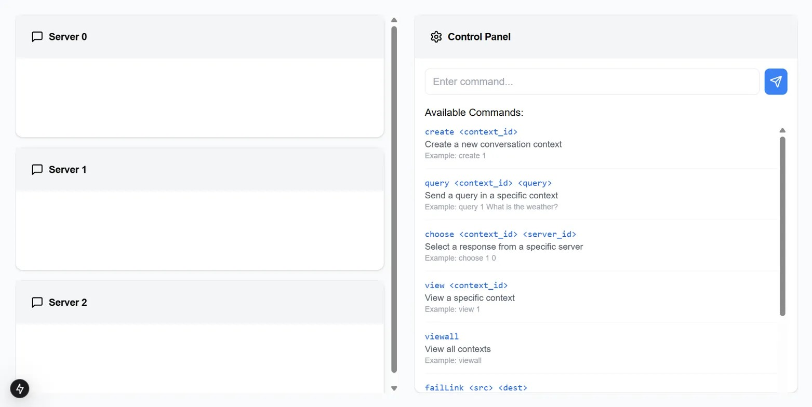

# distributed-llm-service
High level overview: Distributed AI chat system with Python backend and Typescript frontend. 

Users can query three different AI chat servers, choose the best answer, and have the conversation context saved across all three servers using socket programming and a communication protocol called Multi Paxos.

This system is fault tolerant and the users can test failing the links between servers. When a failed server comes back online, it can recover the existing context through multipaxos messages from other servers.

This is an exercise in communication protocols and distributed systems and an expansion of a school project.

Basic Usage:

"create [context name]" to create a new context

"query [context name] [prompt]" to make a query to a certain context.

"choose [context name] [number]" to choose the answer from server [number]

# Run in terminal
Go to backend folder
Run ./dev.sh

# Run frontend/backend locally (under testing)
Run uvicorn app.main:app --reload in backend folder
Run npm run dev in frontend folder

